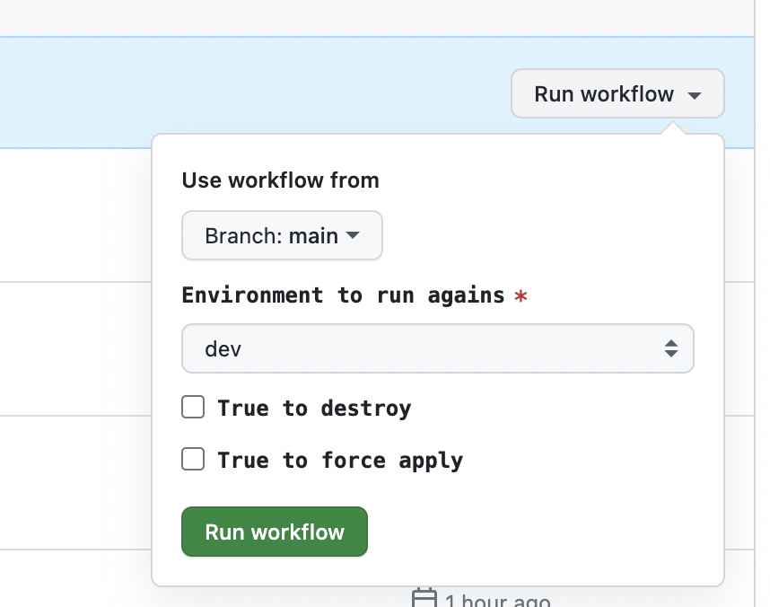

# AWS Terraform Examples

This repo is used to deploy AWS applications using Terraform.

## Install Terraform CLI

Terraform provides several ways to install Terraform CLI on machine in its official website, but I recommend to use `tfenv` which is a [Terraform](https://www.terraform.io/) version manager inspired by `rbenv`. With `tfenv`, you are able to manage and switch between multiple Terraform versions easily when you have to work on many projects using different Terraform versions.

I installed `tfenv` manually on my desktop (MacBook Air M2) following the `tfenv` [README](https://github.com/tfutils/tfenv).

Firstly, you check out `tfenv` into any path (for me, it's my user home root path ${HOME}/.tfenv).

```bash
git clone --depth=1 https://github.com/tfutils/tfenv.git ~/.tfenv
```

Then, make symlinks for `tfenv/bin/*` scripts into a path that is already added to your $PATH (e.g. /usr/local/bin) OSX/Linux Only!

```bash
sudo ln -s ~/.tfenv/bin/* /usr/local/bin
```

Open another terminal, and run `tfenv -v` to check if the installation works. Finally, install Terrafrom version you required using command `tfenv install x.x.x`. In this repo, I use Terraform version `1.4.2`, so run below command to install `1.4.2`.

```bash
tfenv install 1.4.2

# Switch to use 1.4.2
tfenv use 1.4.2

# validate current Terraform version
terraform -v
# Terraform v1.4.2
# on darwin_arm64
```

## Install AWS CLI

Follows AWS official document to install AWS CLI V2 on your machine.

<https://docs.aws.amazon.com/cli/latest/userguide/getting-started-install.html>

```bash
aws --version
# aws-cli/2.11.3 Python/3.11.2 Darwin/21.6.0 exe/x86_64 prompt/off
```

## Setup AWS Credentials

After installing AWS CLI, you must setup AWS credentials on the machine so that you can deploy Terraform resources to AWS account. AWS provides a detailed document to introduce how to setup AWS credentials based on different AWS authentication methods. In this repo, I choose long-term credentials which is not recommended in a real project because of security risks. Follow <https://docs.aws.amazon.com/cli/latest/userguide/cli-authentication-user.html> to setup AWS credentials.

> When you attach policies for your IAM user, choose `AdministratorAccess` in order to deploy AWS resources. As I'm going to reuse this IAM user to deploy a batch of AWS resources, attach `AdministratorAccess` is pretty easiler, but lack of security. You should keep it in mind.

Use a named profile, for exmaple `app-deployer` instead of `default` if you have multiple profiles.

```bash
# ~/.aws/credentials
[app-deployer]
aws_access_key_id = <aws_access_key_id>
aws_secret_access_key = <aws_access_key_id>

# ~/.aws/config
[profile app-deployer]
region = ap-southeast-1
output = json
```

Run `aws sts get-caller-identity --profile app-deployer` to validate if the crendetial works. You should get output as below.

```json
{
    "UserId": "XXXXXXXXXXXXXXXXXXXX",
    "Account": "123456789012",
    "Arn": "arn:aws:iam::123456789012:user/user1"
}
```

Now, your local machine is ready for deployment.

## Setup GitHub Environment for GitHub Actions Workflows

In the repo, I use GitHub Actions to deploy Terraform project into AWS account. In order to use AWS credentials and configure Terraform remote backend in workflow, I save these variables (sensitive and insensitive) in GitHub Environment.

Firstly, under `Settings` -> `Environments`, create an environment named `dev`. Then create two secrets and three variables in `dev` environment. These tokens will be injected into workflow build.

Secrets:

```yaml
# The AKSK of the IAM user you created to deploy Terraform resources in previous step.
AWS_ACCESS_KEY_ID
AWS_SECRET_ACCESS_KEY
```

Variables:

```yaml
AWS_REGION
AWS_ACCOUNT
# The bucket name of the Terraform remote s3 backend. The S3 bucket must exist.
STATE_BUCKET
```

All GitHub Actions workflows in this repo can use these tokens.

## Run GitHub Actions Workflows Manually

Run the target workflow manually from GitHub console.

- Choose the target environment to deploy. Currently only dev is available.
- Check `True to destroy` checkbox if you want to destory the resources.
- Check `True to force` checkbox if you want to apply refresh the secure tokens. Useful when there is no change in Terraform infra, but there is a variables or secrets update in Github Settings.



## References

- [Configure the AWS CLI](https://docs.aws.amazon.com/cli/latest/userguide/cli-chap-configure.html)
- [Using secrets in GitHub Actions](https://docs.github.com/en/actions/security-guides/using-secrets-in-github-actions)
- [Creating secrets for an environment](https://docs.github.com/en/actions/security-guides/using-secrets-in-github-actions#creating-secrets-for-an-environment)
