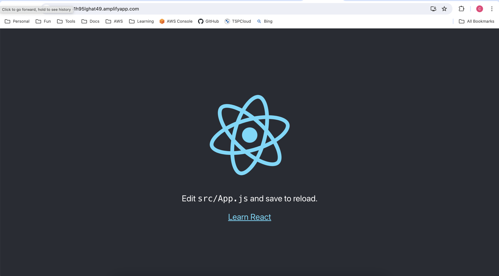

# Host a React App on AWS Amplify

The template provides source code to build a React application using AWS Amplify.

## Terraform Structure

```bash
.
├── .env.sample                     # file for environment variables
├── .terraform.lock.hcl
# All file with .tf extension are Terraform related
├── 01_variables.tf                 # Terraform variables
├── 01_versions.tf                  # Terraform providers and versions
├── 02_main.tf                      # Terraform resources
├── 03_outputs.tf
├── Makefile                        # Make scripts
├── README.md
├── amplifyapp                      # Source code for React application
├── tf_prod.tfvars                  # Terraform variables for specific environment
```

## Local Deploy

Create a `.env` from `env.sample`, and update environment variables as needed. The `.env` file won't be checked into your source code. After updated, these variables in `.env` will be injected into `Makefile` when you execute `make` commands. You can run `make check_env` to validate these variables.

Another option to specify value of variable is to provide the value in command which has high priority than `.env`. For example, use `make ENVIRONMENT=prod check_env` to overwrite the `ENVIRONMENT` variable to `prod` instead of `dev` defined in `.env`.

Setup local development and AWS credentials following [README](../README.md) before you can deploy AWS resources using below commands.

```bash
# Create a Terraform plan named `tfplan`
make plan

# Apply the plan `tfplan`
make apply

# For quick plan & apply
make quick-deploy
```

## Local Destroy

Run below commands to destroy resouces.

```bash
# Create a Terraform destroy plan named `tfplan`
make plan-destroy

# Apply the destroy plan `tfplan`
make apply

# For quick plan-destory & apply
make quick-destroy
```

## GitHub Actions

You can also deploy the project to AWS account via GitHub Actions workflows. I created a workflow which has the same name of project directory. Follow [Setup GitHub Environment for GitHub Actions Workflows](../README.md#setup-github-environment-for-github-actions-workflows) to setup and run GitHub Actions workflow from console.

## Enable Connection between GitHub & Amplify Manually

1. Go to AWS Console -> Amplify. There is a warning popup shows that you need to manual enable a connection from AWS console, so that your source code change is able to trigger a build automatically.
   
2. Click on "View app" button. A dialog named "Migrate to our GitHub app" appears.
   
3. Click on "Start migration". Configure GitHub App. You should get "GitHub authorization successful" after a few seconds. Next -> Complete installation.

## Start a Job for First Deploy

1. Click on "View app" button again, click on "main".
2. Click on "Run job" button to start a new job for your Amplify branch **main**. The job will takes a 2-3 minutes.


## View Your Application via Domain

Domain URL: <https://main.d151h95lghat49.amplifyapp.com>

> Please be noted that the demo Apmlifyapp is removed after demostration.



## References
