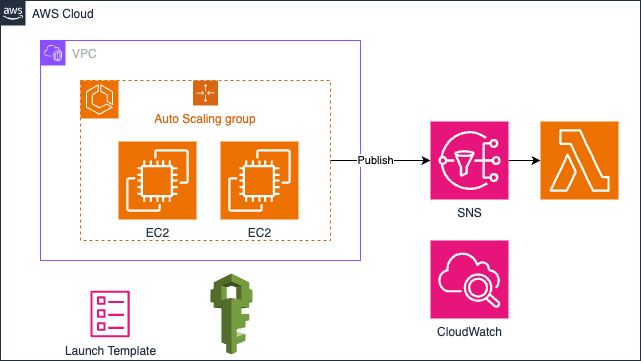

# ECS Cluster EC2 on Type

A terraform project that is used to create an ECS Cluster with EC2 type in the default VPC, subnets and security group in the AWS account.

The created AWS resources include:

1. An ECS Cluster with EC2 type.
2. An CS Cluster Capacity Provider.
3. An Auto Scaling Group that attached to ECS Cluster via ECS Cluster Capacity Provider.
4. An EC2 launch template that defines the EC2 configuration that launched in ECS Cluster.
5. A Lambda function that gracefully drains container instances when cluster scaling in.
6. A SNS topic that is triggered by ASG lifecycle hook and post a message to Lambda function when scaling in happens.
7. Several CloudWatch Logs groups to collect logs from ECS Cluster and Lambda function.
8. IAM roles for ECS Cluster and Lambda function.

The archtecture diagram shows as below.



## Project Structure

```bash
.
├── .terraform.lock.hcl
├── .env.sample                 # file for environment variables
├── 01_data.tf                  # All file with .tf extensions are Terraform related
├── 01_locals.tf
├── 01_variables.tf
├── 01_versions.tf
├── 02_cluster.tf
├── 02_lambda.tf
├── 02_launch_template.tf
├── 02_role.tf
├── 02_sns.tf
├── 03_outputs.tf
├── Makefile                    # Define several common useful Make scripts
├── README.md
├── ecs-cluster-on-ec2.png
├── ecs-container-draining.py   # Lambda source code
├── ecs.sh                      # Launch template user data 
├── tf_dev.tfvars               # Terraform variables per environments
├── tf_prod.tfvars
```

## Local Deploy

Create a `.env` from `env.sample`, and update environment variables as needed. The `.env` file won't be checked into your source code. After updated, these variables in `.env` will be injected into `Makefile` when you execute `make` commands. You can run `make check_env` to validate these variables.

Another option to specify value of variable is to provide the value in command which has high priority than `.env`. For example, use `make ENVIRONMENT=prod check_env` to overwrite the `ENVIRONMENT` variable to `prod` instead of `dev` defined in `.env`.

Setup local development and AWS credentials following [README](../README.md) before you can deploy AWS resources using below commands.

```bash
# Create a Terraform plan named `tfplan`
make plan

# Apply the plan `tfplan`
make apply
```

## Local Destroy

Run below commands to destroy resouces.

```bash
# Create a Terraform destroy plan named `tfplan`
make plan-destroy

# Apply the destroy plan `tfplan`
make apply
```

## References

- [How to Automate Container Instance Draining in Amazon ECS](https://aws.amazon.com/blogs/compute/how-to-automate-container-instance-draining-in-amazon-ecs/)
