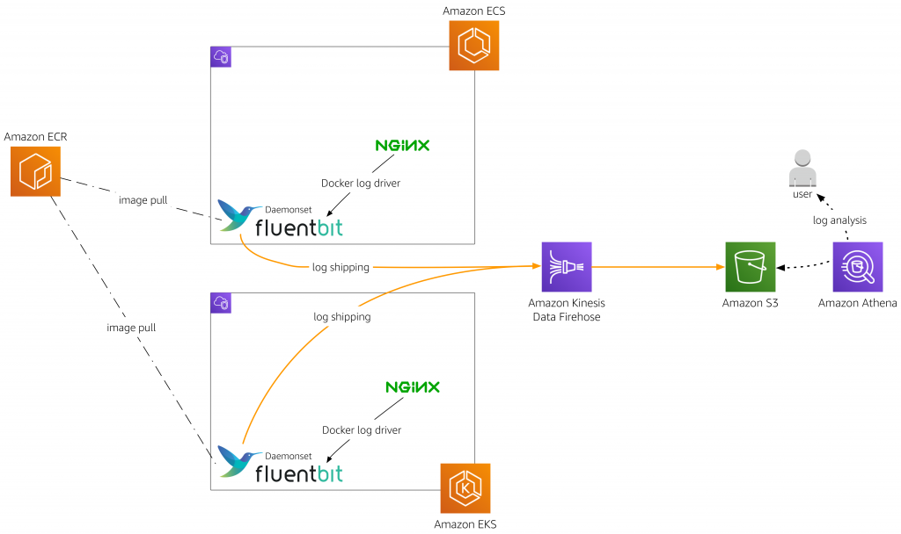
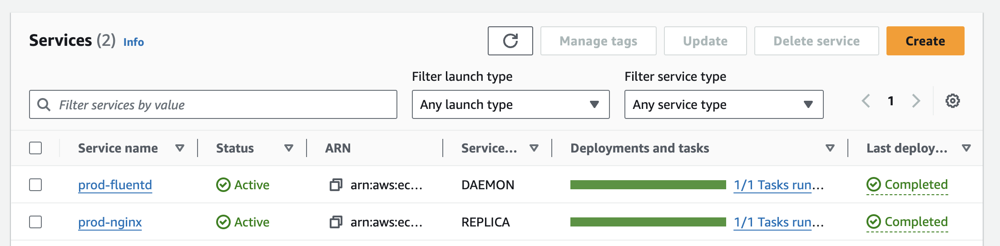

# Centralized Logging - ECS Service (Daemon) for Fluent-Bit

The project is used to deploy a daemonset service for Fluent-Bit in AWS ECS Cluster to enable centralized container logging with Fluent Bit.

The Terraform resources deployed in the project include:

- An ECS service with scheduling strategy as DAEMON
- An ECS task definition for above service using docker image `camillehe1992/fluent-bit:latest`
- An IAM task role attached on task
- An firehose Delivery Stream destinate to S3

> The creation of S3 bucket for logging data is not covered in the project, which means you have to create the S3 bucket and update variable `firehose_bucket_name` default value in `variables.tf` before applying the project.
>
> The creation of NGINX apps are covered in another project. See `ecs-service-nginx` for the details.

The architecture diagram shows as below. The application-level logs generated by NGINX apps running in each cluster is captured by Fluent Bit and streamed via Amazon Kinesis Data Firehose to Amazon S3, where we can query them using Amazon Athena.



## Project Structure

```bash
.
├── .env.sample                 # file for environment variables
├── .terraform.lock.hcl
├── 01_data.tf                  # All file with .tf extensions are Terraform related
├── 01_local.tf
├── 01_variables.tf
├── 01_versions.tf
├── 02_firehose.tf
├── 02_main.tf
├── 02_roles.tf
├── 03_outputs.tf
├── Dockerfile                  # Dockerfile for custom fluent-bit image
├── Makefile                    # Define several common useful Make scripts
├── README.md
├── fluent-bit.conf             # fluent-bit configuration file
├── parsers.conf                # fluent-bit parsers file
├── tf_dev.tfvars               # Terraform variables per environments
├── tf_prod.tfvars
```

## Fluent Bit Configuration & Parsers

`fluent-bit.conf` file defines the routing to the Firehose delivery stream. Don't forget the update `delivery_stream` field as the real Firehose Delivery Stream name that you created.

`parsers.conf` file defines the NGINX log parsing.

## Build & Publish Docker Image

Use below command to publish Docker image to a docker registry, for example DockerHub.

> The `make create-image` script creates a docker image that is compatiable with both amd64/arm64 Arch OS.

```bash
make create-image
```

Finally, the docker image is published to DockerHub `camillehe1992/fluent-bit:latest` successfully.

## Local Deploy

Create a `.env` from `env.sample`, and update environment variables as needed. The `.env` file won't be checked into your source code. After updated, these variables in `.env` will be injected into `Makefile` when you execute `make` commands. You can run `make check_env` to validate these variables.

Another option to specify value of variable is to provide the value in command which has high priority than `.env`. For example, use `make ENVIRONMENT=prod check_env` to overwrite the `ENVIRONMENT` variable to `prod` instead of `dev` defined in `.env`.

Setup local development and AWS credentials following [README](../README.md) before you can deploy AWS resources using below commands.

```bash
# Create a Terraform plan named `tfplan`
make plan

# Apply the plan `tfplan`
make apply
```

## Local Destroy

Run below commands to destroy resouces.

```bash
# Create a Terraform destroy plan named `tfplan`
make plan-destroy

# Apply the destroy plan `tfplan`
make apply
```

## Log Collection from ECS Service NGINX

After deploying Fluent Bit as a DeamonSet in ECS Cluster, a task will be launched in each container instance for logging collection. I also deployed a NGINX ECS service in the ECS Cluster using `ecs-service-nginx` project to demonstrate Fluent Bit functionalities.



Access the NGINX via NGINX load balancer DNS name, like `http://nginx-prod-xxxxxxxx.aws-region.elb.amazonaws.com/`. You should be redirected to the welcome page of NGINX.

## Create VPC Endpoint for Firehose

Find the `fluentd` task logs from log stream named with prefix `fluentd/prod-fluentd-daemon` from CloudWatch Logs group `PROD-APP-ECS-CLUSTER`.

You may meet timeout errors when Fluent Bit push logs into Firehose stream as below. That's becuase the Fluent Bit task in VPC is trying to access Firehose outside of VPC via public internet. 

```text
time="2023-11-27T02:12:28Z" level=error msg="[firehose 0] PutRecordBatch failed with RequestError: send request failed\ncaused by: Post \"https://firehose.cn-north-1.amazonaws.com.cn/\": dial tcp 52.81.167.128:443: i/o timeout"
```

## References

- [](https://fluentbit.io/)
- [Centralized Container Logging with Fluent Bit](https://aws.amazon.com/blogs/opensource/centralized-container-logging-fluent-bit/)
- [Task role vs task execution role in Amazon ECS](https://towardsthecloud.com/amazon-ecs-task-role-vs-execution-role)
