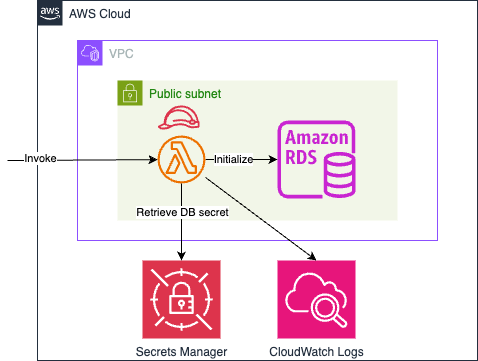

A terraform project that is used to create a MYSQL RDS instance in AWS, with the Lambda function which is intended for database initialization.

The AWS resources created in the project includes:
1. A RDS instance with custom parameter group. The database secret is managed in Secrets Manager.
2. A Lambda function and CloudWatch Logs group for function logs persistance. 
3. A Lambda function execution IAM role with appropriate permissions.

The architecture diagram shows as below.



## Project Structure

```bash
.
├── 01_data.tf                      # All file with .tf extension are Terraform related
├── 01_variables.tf
├── 01_versions.tf
├── 02_lambda_function.tf           # Use modules for AWS resoures
├── 02_main.tf
├── 03_outputs.tf
├── Makefile                        # Make scripts
├── README.md
├── rds-mysql-with-lambda.png
├── src                             # Lambda function source code
│   ├── index.js
│   ├── node_modules
│   ├── package-lock.json
│   ├── package.json
│   └── script.sql
├── tf_dev.tfvars                   # Terraform variables per env
├── tf_prod.tfvars

```

## Local Deploy
Create a `.env` from `env.sample`, and update environment variables as needed. The `.env` file won't be checked into your source code. After updated, these variables in `.env` will be injected into `Makefile` when you execute `make` commands. You can run `make check_env` to validate these variables. 

Another option to specify value of variable is to provide the value in command which has high priority than `.env`. For example, use `make ENVIRONMENT=prod check_env` to overwrite the `ENVIRONMENT` variable to `prod` instead of `dev` defined in `.env`.

Setup local development and AWS credentials following [README](../README.md) before you can deploy AWS resources using below commands.

```bash
# Create a Terraform plan named `tfplan`
make plan

# Apply the plan `tfplan`
make apply

# Outputs:

# aws_db_instance = {
#   "arn" = "arn:aws-cn:rds:cn-north-1:123456789012:db:my-demo-rds"
#   "endpoint" = "my-demo-rds.abcdefg.rds.cn-north-1.amazonaws.com.cn:3306"
# }
# secret_arn = "arn:aws-cn:secretsmanager:cn-north-1:123456789012:secret:XXXXXXXXX"
```

## Local Destroy
Run below commands to destroy resouces.

```bash
# Create a Terraform destroy plan named `tfplan`
make plan-destroy

# Apply the destroy plan `tfplan`
make apply
```

> Don't forget to open port 3306 on the security group if you want to access database from Internet.


## Retrieve RDS database secret from AWS Secrets Manager
Export secret arn in environment variable using below command.

```bash
export SECRET_ID=$(terraform output -raw secret_arn)
```

Use AWS CLI to fetch auto generated secret for RDS database that managed in AWS Secrets Manager.

```bash
make get-secret
```
Then, you can access RDS database using secret above via `endpoint` in terraform output.

## Initialize RDS database using pre-defined script via Lambda Function
In order to connect to RDS database and initialze it, we created a Lambda function to execute SQL statements. The related source code locates in `src` folder.
```bash
src
├── index.js
├── package-lock.json
├── package.json
└── script.sql
```

The script in `script.sql` file is what the function executes.
```sql
CREATE DATABASE IF NOT EXISTS pokemon;

USE pokemon;

CREATE TABLE
    IF NOT EXISTS `players` (
        `id` int(5) NOT NULL AUTO_INCREMENT,
        `first_name` varchar(255) NOT NULL,
        `last_name` varchar(255) NOT NULL,
        `position` varchar(255) NOT NULL,
        `number` int(11) NOT NULL,
        `image` varchar(255) NOT NULL,
        `user_name` varchar(20) NOT NULL,
        PRIMARY KEY (`id`)
    ) ENGINE = InnoDB DEFAULT CHARSET = latin1 AUTO_INCREMENT = 1;
```

Use AWS CLI to invoke Lambda function to initialize RDS database we just created with the SQL script above.

```bash
export FUNC_ARN=$(terraform output -raw function_arn)
make initialize-rds
```
Here is the Lambda function query response from Cloudwatch logs for a successful initialization.

```json
query result: [{
    "fieldCount": 0,
    "affectedRows": 1,
    "insertId": 0,
    "serverStatus": 10,
    "warningCount": 1,
    "message": "",
    "protocol41": true,
    "changedRows": 0
},{
    "fieldCount": 0,
    "affectedRows": 0,
    "insertId": 0,
    "serverStatus": 10,
    "warningCount": 0,
    "message": "",
    "protocol41": true,
    "changedRows": 0
},{
    "fieldCount": 0,
    "affectedRows": 0,
    "insertId": 0,
    "serverStatus": 2,
    "warningCount": 3,
    "message": "",
    "protocol41": true,
    "changedRows": 0
}]
```
> If you use the default VPC, subnets and secruity group in your AWS account, you probaly meet a timeout issue when invoking Lambda function like me. That's because our Lambda function locates in a VPC in order to connect to RDS database, and it's going to retrive secrets from Secrets Manager which is a service out of VPC. To address the issue, you can create Secrets Manager endpoint within your VPC.

## References
- https://repost.aws/questions/QU1WLg4Q2-TCqznkgmpPnW0g/getting-secret-from-lambda-times-out-when-attached-to-vpc-subnet
- https://docs.aws.amazon.com/AWSJavaScriptSDK/v3/latest/clients/client-secrets-manager/classes/getsecretvaluecommand.html