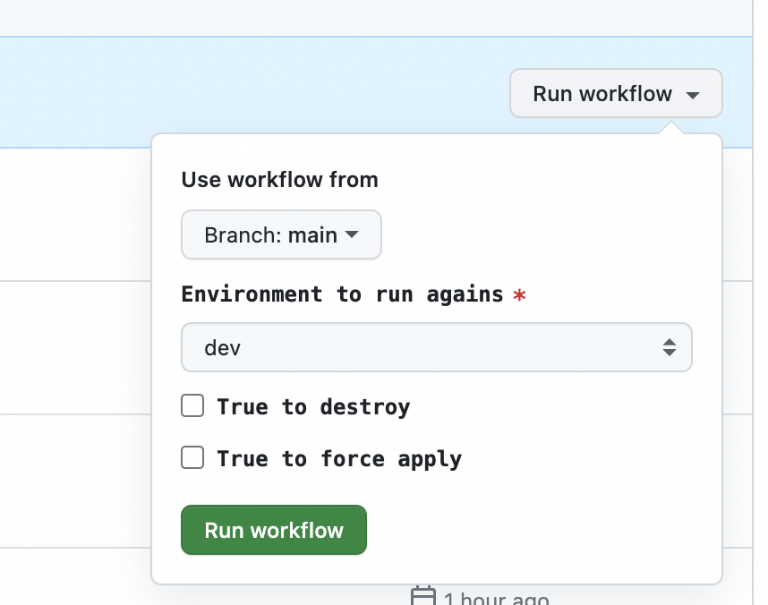

A sample terraform project that used to demonstrate how to save secret tokens in GitHub Actions secrets and deploy them into AWS Secret Manager.

---
In a real project, we need to save sensitive information, such as password, secret key, in a third-party tool for security instead of hard-coded in the source code. These secure tokens are retrieved from third-party tool before in CICD pipeline, and injected into Terrafrom variables during plan. In this demo, I use GitHub Actions secrets to save secure tokens and map them into environments of GitHub workflow. 

## Terraform Structure
```bash
.
├── Makefile                    # a markfile for terraform commands 
├── README.md
├── main.tf                     # define the specs of secretsmanager module
├── modules
│   └── secretsmanager          # secretsmanager module
│       ├── locals.tf
│       ├── main.tf
│       ├── outputs.tf
│       └── variables.tf
├── outputs.tf                  # outputs of terraform
├── tf_dev.tfvars            # variables of terraform
├── variables.tf                # variables definition of terraform
└── versions.tf                 # terraform backend configuration and provider versions
```

## Deploy from Local
Firstly, you must have Terraform CLI installed with `required_version = ">= 1.3.4"`. Then, install AWS CLI and setup AWS credentials in your local machine. The crednetial should have access to create secrets in AWS Secret Manager. You should have two files created under `.aws` folder after configured. 
```bash
# ~/.aws/credentials
[app-deployer]
aws_access_key_id = <aws_access_key_id>
aws_secret_access_key = <aws_access_key_id>

# ~/.aws/config
[profile app-deployer]
region = ap-southeast-1
output = json
```

## Deploy via GitHub Actions Workflow
Before triggering the GitHub workflow from GitHub console, you should add secrets in GitHub console. In the demo, I created a `Environment` named `dev` add three secrets and two variables in it. `AWS_ACCESS_KEY_ID` and `AWS_SECRET_ACCESS_KEY` are used for Terraform infrastructure deployment. `TF_VAR_DATABASE_PASSWORD` is the secure token we need to save in Secret Manager.

> `DATABASE_PASSWORD` is prefixed with `TF_VAR_` to distinguish Terraform secure variables with workflow secrets

Secrets:
- AWS_ACCESS_KEY_ID
- AWS_SECRET_ACCESS_KEY
- TF_VAR_DATABASE_PASSWORD

Variables:
- AWS_REGION
- AWS_ACCOUNT
- STATE_BUCKET

Then trigger the [workflow](../.github/workflows/secret-manager-apply.yaml) manually from GitHub console.

- Choose the target environment to deploy. Currently only dev is available.
- Check `True to destroy` checkbox if you want to destory the resources.
- Check `True to force` checkbox if you want to apply refresh the secure tokens. Useful when there is no change in Terraform infra, but there is a variables or secrets update in Github Settings. 




## Reference
- https://docs.aws.amazon.com/cli/latest/userguide/cli-chap-configure.html
- https://docs.github.com/en/actions/security-guides/using-secrets-in-github-actions
- https://docs.github.com/en/actions/security-guides/using-secrets-in-github-actions#creating-secrets-for-an-environment
- https://registry.terraform.io/providers/hashicorp/aws/latest/docs/resources/secretsmanager_secret