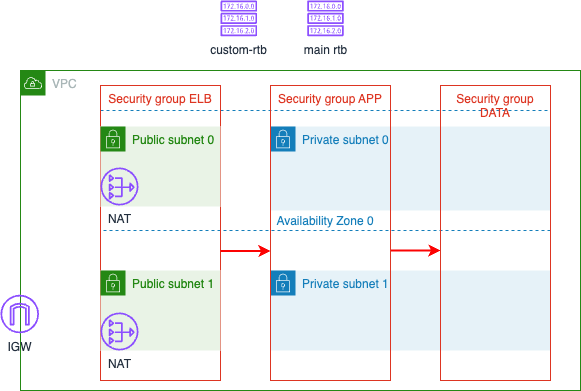

# Three Layers Network Archtecture

A demo project to create a three layers network infrastructure in AWS following AWS Well-Archtected and best practice. The detail archtecture shows as below diagram.

In the diagram, we created one VPC with internet gateway to allow internet access. In the VPC, there are two public subnets and two private subnets which distributed in different availablity zones. Three security groups are created for different layers, load balancer, application and database layers.

A Main route table is created automatically with implicit private subnet association. Besides, we created a custom route table with explicit public subnet association. For each public subnet, We added a route in the custom route table from public subnets to internet gateway.

In some scenarios, instances in private subnets should have internet access, that is why NAT gateway comes into place. In each public subnet, we setup a NAT gateway, so that the traffic from private subnets can be routed to the internet through NAT gateway.

Three Security groups are created for different purposes in order to the best practice for network access control. Security group ELB is created to secure Elastic Load Balancer with public access enabled. Security group APP is used to secure applications, web servers, etc that run in EC2 instances or other compute resources. It only allows ingress traffic from Security group ELB. Security group Data is for database resources, for example, RDS instances. It only allows ingress traffic from Security group APP.

It's best practice to manage your applications in the public cloud with restricted network access control for security and management.

## Terraform Structure

```bash
.
├── .env.sample                     # file for environment variables
├── .terraform.lock.hcl
├── 01_data.tf                      # All file with .tf extension are Terraform related
├── 01_local.tf
├── 01_variables.tf                 # All file with .tf extension are Terraform related
├── 01_versions.tf
├── 02_main.tf                      # Use modules for AWS resoures
├── 03_outputs.tf
├── arch-diagram.png
├── Makefile                        # Make scripts
├── README.md
├── tf_dev.tfvars                   # Terraform variables per env
├── tf_prod.tfvars
```

## Archtecuture Diagram



## Local Deploy

Create a `.env` from `env.sample`, and update environment variables as needed. The `.env` file won't be checked into your source code. After updated, these variables in `.env` will be injected into `Makefile` when you execute `make` commands. You can run `make check_env` to validate these variables.

Another option to specify value of variable is to provide the value in command which has high priority than `.env`. For example, use `make ENVIRONMENT=prod check_env` to overwrite the `ENVIRONMENT` variable to `prod` instead of `dev` defined in `.env`.

Setup local development and AWS credentials following [README](../README.md) before you can deploy AWS resources using below commands.

```bash
# Create a Terraform plan named `tfplan`
make plan

# Apply the plan `tfplan`
make apply
```

## Local Destroy

Run below commands to destroy resouces.

```bash
# Create a Terraform destroy plan named `tfplan`
make plan-destroy

# Apply the destroy plan `tfplan`
make apply
```

## References

- [How Amazon VPC works](https://docs.aws.amazon.com/vpc/latest/userguide/how-it-works.html)
- [Setting up a NAT gateway on AWS using Terraform](https://dev.betterdoc.org/infrastructure/2020/02/04/setting-up-a-nat-gateway-on-aws-using-terraform.html)
